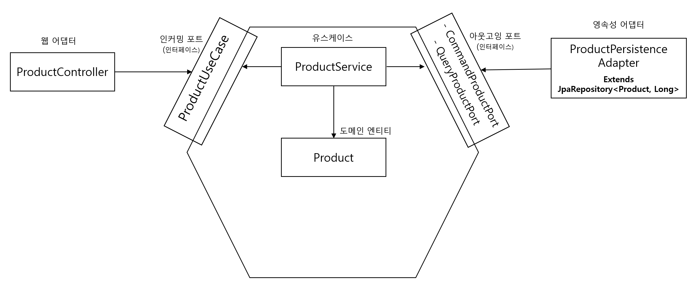

# 만들면서 배우는 클린 아키텍처

#### 책 내용의 이해를 위해 각 코드에 주석을 남깁니다.
- 책 정보 : https://wikibook.co.kr/clean-architecture/

#### 해당 예제 코드는 아래 링크에서 참조하였습니다.
- 예제 코드 원본 : https://github.com/wikibook/clean-architecture

---
## 내용 정리

#### 일반적인 계층형 아키텍처는 데이터베이스 주도 설계를 유도한다
- 계층형 아키텍처는 의존성의 방향에 따라 자연스럽게 구현하므로 데이터베이스의 구조를 먼저 생각한다.
- 하지만 데이터베이스를 토대로 설계하기보다는, 도메인 로직을 먼저 만드는 것이 비즈니스 관점에서 맞는 방법이다.
  - 도메인 로직 개발 후 -> 영속성 계층, 웹계층 개발

#### 저자가 보는 계층형 아키텍처의 단점
- `특정한 계층에서는 같은 계층에 있는 컴포넌트나 아래에 있는 계층에만 접근 가능`이라는 유일한 규칙
  - 따라서 많은 것들이 잘못된 방향으로 흘러가도록 용인

#### 단일 책임 원칙 (SRP)
- 컴포넌트를 변경하는 이유는 오직 하나뿐이어야 한다.
  - (feat. 하나의 컴포넌트는 오로지 한 가지 일만 해야 하고, 그것을 올바르게 수행해야 한다.)
  - 도메인 코드가 바깥으로 향하는 어떤 의존성도 없게 함으로써 다른 외부적인 요소로 인해 변경되는 일이 없게 만든다.

#### 의존성 역전 원칙 (DIP)
- 코드상의 어떤 의존성이든 그 방향을 바꿀 수(역전시킬 수) 있다.
  - 계층형 아키텍처에서 하위 계층인 영속성 계층에 의해 도메인 계층이 변경되는 것을 인터페이스를 통해 DIP(의존 역전)를 적용

#### 인터페이스 분리 원칙 (ISP)
- 클라이언트가 오로지 자신이 필요로 하는 메서드만 알면 되도록 넓은 인터페이스를 특화된 인터페이스로 분리해야 한다
  - 즉 잘게잘게 쪼개라

 

### 헥사고날 아키텍처

#### 코드숨 하면서 직접 그려봤던 헥사고날 아키텍처

 

#### 엔티티 (domain 패키지)
- 서비스와 잠재적으로 어댑터에서도 접근 가능하도록 public으로 설정하자
- 유스케이스 안에서 중심을 지키고 있는 도메인은 모든 계층의 의존을 받는다 (도메인이 외부로 향하는 의존따윈 없다)
- 엔티티 생성자는 유효한 상태의 엔티티만 생성할 수 있는 `팩터리 메서드`를 제공하는 방법도 좋은 것 같다

#### [도메인 엔티티의 역할]
  - 비즈니스 규칙을 검증 (도메인 엔티티 내에 비즈니스 규칙을 구현하자 : Tell, Don't Ask)
  - 실제 값을 변경하는 비즈니스 로직 수행

---

#### 유스케이스 (application 패키지)
- 서비스는 인커밍 포트 인터페이스 뒤에 숨겨질 수 있기 때문에 public일 필요가 없다는데, 이 부분은 잘 이해가 안된다 (관련 포트가 public이 아닐 때를 얘기하는 거겠지..?)
- 인커밍/아웃고잉 어댑터가 각자 유스케이스쪽으로 의존성을 향한다 (아웃고잉 어댑터 의존 역전)
- 애플리케이션 계층은 인커밍/아웃고잉 어댑터에 대한 직접적인 의존성을 갖지 않는다 (포트를 통해서만 통신)
- 유스케이스 코드가 도메인 로직에만 신경써야 하고, 입력 유효성 검증으로 오염되면 좋지 않다
#### [유스케이스의 역할] 
  - 비즈니스 규칙을 검증 (입력 유효성 검증과는 별개) - **도메인 엔티티와 책임을 공유**
  - 모델 상태를 조작
  - 출력을 반환

---

#### 인커밍/아웃고잉 포트 (application 패키지)
- 어댑터와 애플리케이션 사이를 이어주는 오작교이다 (인터페이스)
- 의도적으로 어댑터에서 접근 가능해야 하는 포트들은 public으로 설정하자

---

#### 인커밍/아웃고잉 어댑터 (adapter 패키지)
- 외부 환경으로부터 유스케이스에 맞게 형식을 변경하여 사용하는/사용되는 어댑터 역할을 담당한다
- application 패키지 내에 있는 포트 인터페이스를 통하지 않고는 바깥에서 호출되지 않으므로 `package-private` 접근 수준으로 설정하자 
- 어댑터 코드를 자체 패키지로 이동시키므로써, 하나의 어댑터를 다른 구현으로 쉽게 교체할 수 있다
  
#### [웹 어댑터의 역할]
1. HTTP 요청을 자바 객체로 매핑 (역직렬화)
2. 권한 검사
3. 입력 유효성 검증
4. 입력을 유스케이스의 입력 모델로 매핑
5. 유스케이스 호출
6. 유스케이스의 출력을 HTTP로 매핑 후 응답 반환 (직렬화)

역할이 좀 많은 듯 하지만 HTTP와 관련된 것은 애플리케이션 계층으로 침투해서는 안된다  
마찬가지로 어댑터는 어떠한 도메인 로직도 수행하지 않는다

#### [영속성 어댑터의 역할]
1. 입력을 받는다
2. 입력을 데이터베이스 포맷으로 매핑한다
3. 입력을 데이터베이스로 보낸다
4. 데이터베이스 출력을 애플리케이션 포맷으로 매핑한다
5. 출력을 반환한다

도메인 코드는 영속성 포트에 의해 정의된 명세를 어떤 클래스가 충족시키는지에 대한 관심이 없다  
이로써 영속성 계층은 포트의 명세만 충족한다면 하고싶은 어떠한 작업도 다 할 수 있다.  

만약 다른 경계(바운디드 컨텍스트)의 서비스에서 영속성 어댑터가 필요하다면 직접 접근하지 않고, 전용 인커밍 포트를 사용해야 한다
- 어댑터를 그대로 가져다 사용하지말고, 다른 맥락의 서비스를 호출해서 사용하라는 얘기인 것 같다

---

#### 풍부한 도메인 모델
> 도메인 엔티티에 관련된 모든 상태, 행위 관리는 해당 엔티티 객체에 응집한다 
- 애플리케이션의 코어에 있는 엔티티에서 가능한 한 많은 도메인 로직(비즈니스 규칙 검증 포함)을 구현하라
- 엔티티들은 상태를 변경하는 메서드를 제공하고, 비즈니스 규칙에 맞는 유효한 변경만을 허용하라
- 이렇게 된다면 유스케이스는 실제 작업을 수행하는 체계화된 도메인 엔티티 메서드 호출만 진행한다
  - 도메인 모델의 진입점으로써 동작 (사용자의 의도만을 표현)
- **Tell, Don't Ask를 지향하려면 풍부한 도메인 모델을 써야할 듯 하다**

#### 빈약한 도메일 모델
> 도메인 엔티티는 값을 담는 용도로만 사용하고 상태, 행위 관리는 유스케이스로 위임한다
- 엔티티 자체가 굉장히 얇음
  - getter, setter 메서드만 포함하고 어떤 도메인 로직도 가지고 있지 않다
  - 위의 풍부함(비즈니스 규칙 검증, 엔티티 상태 변경, DB 저장 등)이 유스케이스에 존재

 

#### 데이터베이스 트랜잭션 경계는 어디로..?
- 트랜잭션은 하나의 특정한 유스케이스에 대해서 일어나는 모든 쓰기 작업에 걸쳐 있어야 한다. (다 같이 롤백을 위해)
- 따라서 영속성 어댑터 호출을 관장하는 서비스에 위임하자
- 단! 서비스가 `@Transactional` 애노테이션으로 오염되기 싫다면, `AOP`를 통해 트랜잭션 경계를 코드에 위빙하자

 

### 아키텍처 요소 테스트
> 테스트의 비용 : 단위 테스트 < 통합 테스트 < 시스템 테스트 
- 테스트의 비용이 비싸질수록 테스트의 커버리지 목표는 낮게 잡아야 한다

#### 각 계층에 적합한 테스트
- **도메인 엔티티 : 단위 테스트**
  - 도메인 엔티티에 녹아 있는 비즈니스 규칙을 검증하기에 가장 적절한 방법
  - 도메인 엔티티의 행동은 다른 클래스에 거의 의존하지 않기에 다른 종류의 테스트는 필요 없다

- **유스케이스 : 단위 테스트**
  - 저자는 Mock을 사용하여 테스트를 한다
    - 그러면서 테스트가 코드의 행동 변경뿐만 아니라 코드의 구조 변경에도 취약해진다고 설명한다
    - 즉 코드가 리팩터링 되면 테스트도 변경될 확률이 높아진다고 한다
  - 따라서 테스트에서 어떤 상호작용을 검증하고 싶은지 신중하게 생각해야 한다고 한다
    - 그러면서 의존성의 상호작용을 테스트하고 있기 때문에 통합테스트에 가깝다고 말한다
    
     
    
    이 부분에서 유스케이스 자체가 간단한 로직이라면 Presentation 테스트에서 한번에 진행하고, 유스케이스 자체가 복잡하고 핵심 로직이라면 실제 스프링 환경을 띄워서 테스트하는게 더 좋지 않을까라는 생각이 든다.
    - 저자가 단위 테스트보다는 통합테스트에 가깝다고 하니까... 아싸리 `@SpringBootTest`를 띄우는게... 확실하지 않을까?
    - 실제로 Mock으로 테스트를 짜놓으면 그 부분은 신뢰가 안생긴다..
    
     
    
- **웹 어댑터 : 통합 테스트**
    - `@WebMvcTest` : 스프링이 특정 요청 경로, 자바와 JSON 간의 매핑, HTTP 입력 검증 등에 필요한 전체 객체 네트워크를 인스턴스화하도록 만들어준다
      - 웹 컨트롤러가 이 네트워크의 일부로서 잘 동작하는지 검증
    - 웹 컨트롤러는 스프링 프레임워크에 강하게 묶여있기 때문에 격리된 상태로 테스트하기 보다는, 프레임워크와 통합된 상태로 테스트하는 것이 합리적이다.

- **영속성 어댑터 : 통합 테스트**
    - `@DataJpaTest` : 스프링 데이터 리포지토리들을 포함한 데이터베이스 접근에 필요한 객체 네트워크를 인스턴스화해야 한다고 스프링에 알려준다
    - `@Import` : 특정 객체가 이 네트워크에 추가됐다는 것을 명확하게 표현할 때 사용
    - 위 어노테이션을 통한 테스트는 데이터베이스를 모킹하지 않고 실제 DB에 접근한다
    - 또한 스프링은 기본적으로 인메모리 DB를 테스트에서 사용한다 (설정으로 DB 변경 가능)

 

- **사용자의 주요 경로 테스트 : 시스템 테스트**
    - 전체 애플리케이션을 띄우고 API를 통해 요청을 보내며, 모든 계층이 조화롭게 잘 동작하는지 검증하는 테스트
      - 단위 테스트, 통합테스트보다 훨씬 더 실제 사용자를 잘 흉내 내기 때문에 사용자 관점에서 애플리케이션 검증 가능 
    - `@SpringBootTest` : 스프링이 애플리케이션을 구성하는 모든 객체 네트워크를 띄우게 한다
      - 즉 실제 Spring 프러덕션 코드가 띄워질때의 ApplicationContext를 테스트 환경에서도 그대로 띄운다

 

#### 테스트는 라인 커버리지로 기준을 두지말고, 각각의 프로덕션 버그 케이스를 커버할 수 있는 테스트를 쌓아가면서 자주자주 배포하는 방식으로 관리하는 것이 제일 효율적이다.
- 웬만하면 기능 개발 후가 아닌 개발 중에 테스트를 같이 작성하자
- 또한 기능 구현보다 테스트 코드를 관리하는데 더 오랜 시간이 투자된다면 무언가 잘못됐음의 신호이니 테스트 구조를 개선하자
  - (ex. 리팩터링 할때마다 테스트 코드도 변경해야되는 상황 등)
